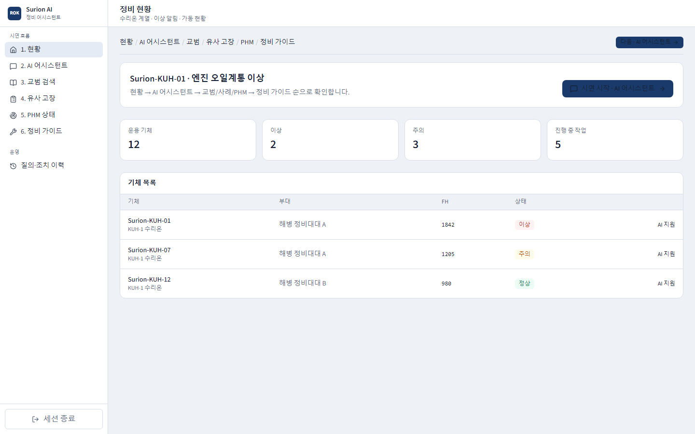
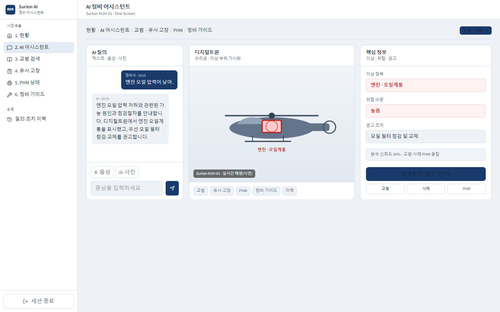
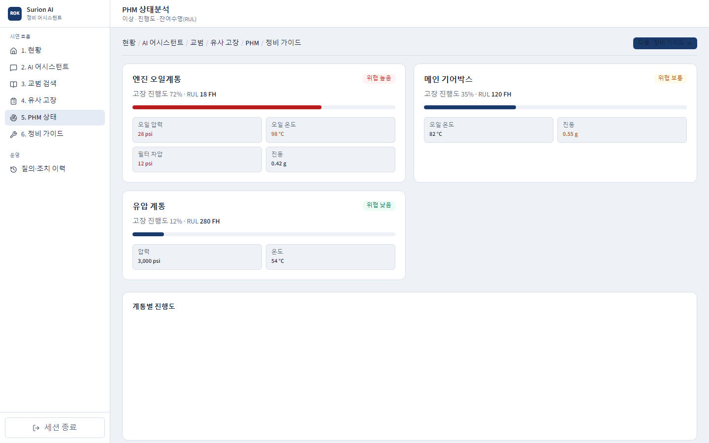

# 항공기 통합정비 AI 어시스턴트

해병대 AI 아이디어 제안을 위해 제작한 **수리온 계열 항공기 통합정비 AI 어시스턴트 시제품**입니다.

항공기 정비 현황, 기술교범, 유사 고장 사례 및 PHM(Prognostics and Health Management, 건전성 예측·관리) 데이터를 통합하여 정비 담당자의 고장 원인 판단과 조치 절차 수립을 지원합니다.

> 본 프로젝트는 제안 및 기능 시연을 위한 프로토타입입니다. 실제 군 정비체계와 연동되지 않으며, 모든 화면과 분석 결과는 임의로 구성한 샘플 데이터를 기반으로 합니다. 실제 항공기 정비 판단이나 작업 지시 용도로 사용할 수 없습니다.

**GitHub Pages:** https://marine-ref.github.io/prototype/

> 최초 1회: [Settings → Pages](https://github.com/marine-ref/prototype/settings/pages)  
> Source = **GitHub Actions** → Save  
> (`main` push 시 Actions가 정적 export를 Pages에 배포합니다.)

## 주요 기능

* 항공기 운용 및 정비 현황 모니터링
* 자연어 기반 정비 AI 질의
* 기술교범 검색 및 관련 항목 추천
* 유사 고장 사례 검색·비교
* PHM 기반 상태 및 위험도 분석
* 단계별 정비 절차 가이드 제공

## 기술 스택

| 분야 | 기술 |
|------|------|
| Frontend | Next.js 15, React 19, TypeScript |
| UI | Tailwind CSS 4 |
| Visualization | SVG 디지털트윈, Recharts |
| AI | Mock Response (프로토타입) |
| Data | JSON Mock (`web/src/data/mock.ts`) |
| Deploy | GitHub Pages (static export · `basePath=/prototype`) |

## 프로젝트 구성

```text
.
├── .github/workflows/     # Pages 배포
├── docs/
│   ├── README.md
│   ├── UI-현황-전달서.md
│   ├── 프로토타입-정의서.md
│   ├── 시스템-아키텍처.md
│   ├── User-Journey-IA.md
│   ├── AI-파이프라인.md
│   ├── API-명세.md
│   ├── DB-ERD.md
│   └── images/                 # README·시연용 스크린샷
└── web/
    ├── package.json
    ├── next.config.ts
    ├── public/
    └── src/
        ├── app/                # 페이지 라우트
        ├── components/         # AppShell, Chat, Twin 등
        └── data/               # mock 데이터
```

| 경로 | 설명 |
|------|------|
| `docs/` | 제안서 기반 요구사항, 기능 정의 및 시스템 설계 문서 |
| `web/` | Next.js 기반 시연용 웹 인터페이스 |

## 실행 방법

### 실행 환경

* Node.js 20 이상 권장
* 별도의 환경변수 설정 불필요
* 외부 AI API 연결 없음
* 샘플(Mock) 데이터 기반 동작

### 로컬 실행

```bash
cd web
npm install
npm run dev
```

실행 후 브라우저에서 다음 주소로 접속합니다.

```text
http://localhost:3000
```

로컬은 basePath 없이 루트 `/`로 동작합니다.  
Pages 배포 빌드: `npm run build:pages` → `web/out`

## 현재 UI 구성

공통 레이아웃은 **좌측 고정 사이드바 + 상단 페이지 헤더 + 본문**입니다.  
사이드바 **시연 흐름**과 본문 상단 **브레드크럼** 순서는 동일합니다.

### UI 미리보기







### 레이아웃

```text
[사이드바]                [본문]
 Surion AI                헤더(제목·부제)
 ├ 시연 흐름               시연 브레드크럼 + 다음 버튼
 │  1. 현황               화면별 콘텐츠
 │  2. AI 어시스턴트
 │  3. 교범 검색
 │  4. 유사 고장
 │  5. PHM 상태
 │  6. 정비 가이드
 └ 운영
    질의·조치 이력
```

### 화면별 현황

| 경로 | 화면 | 현재 UI |
|------|------|---------|
| `/` | 현황 | KPI, 기체 목록, 시연 시작 CTA |
| `/assistant` | AI 어시스턴트 ★ | One-Screen 3단 (챗 / 디지털트윈 / 요약) |
| `/manuals` | 교범 검색 | 장·절·페이지·발췌·출처 카드 |
| `/failures` | 유사 고장 | 유사도·원인·조치·결과 |
| `/phm` | PHM 상태 | 위험·RUL·센서·진행도 차트 |
| `/guide` | 정비 가이드 | 권고 + 단계별 점검순서 |
| `/history` | 질의·조치 이력 | 타임라인 테이블 |

## 핵심 화면 (`/assistant`)

시연의 중심 화면이며, 제안서 One-Screen 구성과 대응합니다.

```text
┌─────────────┬──────────────────┬──────────────┐
│  AI Chat    │  Digital Twin    │  Result      │
│  질의·응답   │  수리온 하이라이트 │  이상·위협·권고 │
└─────────────┴──────────────────┴──────────────┘
```

| 영역 | UI |
|------|-----|
| 좌 · AI 질의 | 정비사↔AI 대화, 텍스트 입력, 음성·사진 버튼(시연용) |
| 중 · 디지털트윈 | 수리온 개략 SVG, 엔진 오일계통 하이라이트 |
| 우 · 핵심 정보 | 이상 항목, 위협 수준, 권고 조치, 근거 바로가기 |

고정 시연 시나리오: **「엔진 오일 압력이 낮아.」 → 오일 필터 점검·교체 권고**

더 자세한 UI 안내는 [`docs/UI-현황-전달서.md`](./docs/UI-현황-전달서.md)를 참고하세요.

## 권장 시연 시나리오

1. 정비 현황 확인  
2. 이상 기체 선택  
3. AI 정비 질의  
4. 관련 기술교범 확인  
5. 유사 고장 사례 비교  
6. PHM 상태 분석  
7. 단계별 정비 가이드 확인  

상세 설계와 기능별 설명은 [`docs/README.md`](./docs/README.md)를 참고하세요.
